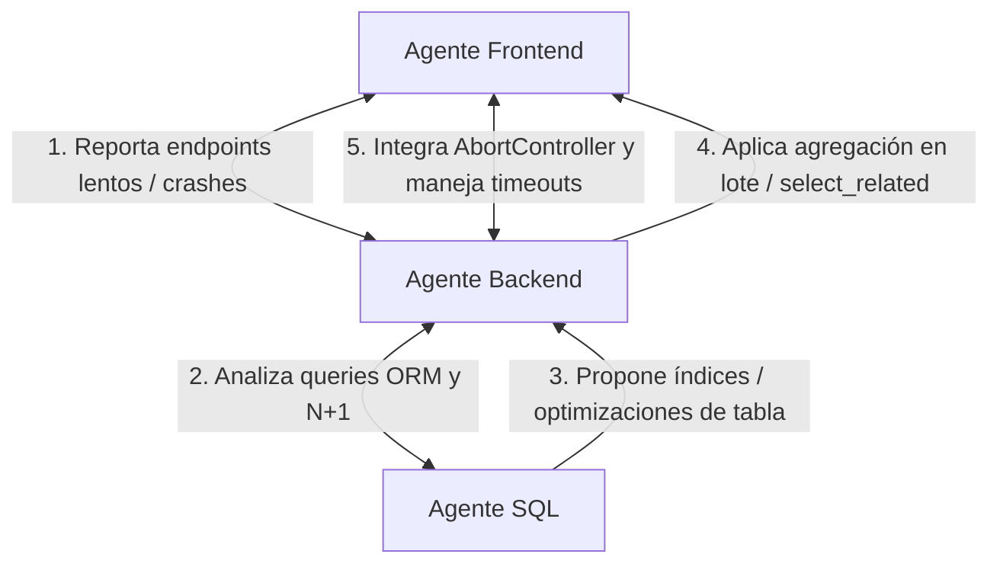

# PLAN DE REVISIÓN Y AUDITORÍA DE SISTEMA DISTRIBUIDO (FABLE 5)

Este documento es el manifiesto operativo y la guía de control para que **Fable 5 de Claude** coordine y ejecute una auditoría profunda sobre el monorepo de la **Consola MWT.ONE**.

El sistema presenta dos problemas críticos que deben ser resueltos de raíz de manera colaborativa por tres agentes especializados: **Base de Datos (SQL)**, **Backend (Python Django)** y **Frontend (React)**.

> Stack real (ver `CLAUDE.md`): React 18 + Vite (JSX) · Django 4 + DRF + SimpleJWT ·
> PostgreSQL (pgvector) con SQL crudo vía `connection.cursor()` y vinculación lógica
> por UUID **sin Foreign Keys físicas** · Docker Compose en VPS único (deploy rolling).

---

## 1. Definición de Roles de Agentes

### 🛡️ Agente de Base de Datos (SQL Auditor)
*   **Alcance**: Auditoría de esquemas (`core`, `users`, `clientes`, `expedientes`, `pipeline`, `commercial`, `pricing`, `finance`, `cobros`, `transfers`, `nodos`, `brands`, `productos`, `proveedores`, `inventario`, `analytics`, `ai_hub`) definidos en `database/init.sql` + módulos incrementales `backend/sql/*.sql`.
*   **Foco**:
    *   Identificar consultas lentas usando el log de PostgreSQL o mediante análisis estático de consultas complejas (`EXPLAIN ANALYZE`).
    *   Verificar la existencia de índices en columnas usadas en `WHERE`, `JOIN` y `ORDER BY` — especialmente las columnas UUID de vinculación lógica (`oc_id`, `expediente_id`, `client_id`, `producto_id`, `fusion_id`, `transferencia_id`, `aggregate_id`), ya que la arquitectura prohíbe FKs físicas.
    *   Evaluar tipos de datos eficientes e indexación de búsqueda de texto (GIN / trigram para búsquedas parciales de clientes/expedientes en la barra Cmd+K).
    *   Proponer índices y optimizaciones SQL crudas al Agente de Backend como módulos idempotentes `backend/sql/E*.sql` (zero-downtime).

### ⚙️ Agente de Backend (Python Django Auditor)
*   **Alcance**: Auditoría del código en `backend/apps/` (25 apps: ai_hub, analytics, brands, clientes, cobros, commercial, core, email_templates, expedientes, finance, finanzas, inventario, nodos, notifications, ocr, portal, productos, proveedores, roles, sizing, storage, tickets, transfers, users) y `backend/sql/`.
*   **Foco**:
    *   Detectar **N+1 queries** en serializadores DRF: `SerializerMethodField` que ejecutan un query POR FILA del listado (patrón confirmado en `ExpedienteListSerializer`: `proforma_codigos`/`oc_codigos`/`sap_codigos` consultan `documento`/`linea` por expediente).
    *   Auditar procesamiento pesado (landed cost, conciliaciones, OCR, factura-payload) y proponer agregación en SQL o tareas en segundo plano si bloquean el request.
    *   Optimizar la serialización (evitar `fields = "__all__"` con anidados masivos; paginar listados grandes).
    *   Verificar que no existan capturas genéricas (`except Exception:` / `except:`) que oculten fallas de BD o latencia — el manifiesto del repo las marca como smell con exigencia de excepción específica + log estructurado.

### 🎨 Agente de Frontend (React Auditor)
*   **Alcance**: Auditoría de `frontend/src/` (pages, components, context, hooks, lib).
*   **Foco**:
    *   Resolver la **pantalla en blanco** implementando `ErrorBoundary` a nivel de rutas (`App.jsx`) y de widgets individuales (el Dashboard ya tiene `SafeWidget`; generalizar el patrón).
    *   Evitar fugas y crashes por desmontado temprano: introducir soporte de `AbortController`/`signal` en `apiFetch` (`frontend/src/lib/api.js`) y cancelar requests al desmontar (varios efectos ya usan el patrón `let alive/cancel`, pero el request HTTP sigue vivo).
    *   Asegurar acceso seguro a datos anidados aún no cargados (`data?.prop?.nested`, estados de loading explícitos — regla §4 del CLAUDE.md).
    *   Auditar `AuthContext.jsx` + refresco silencioso JWT en `api.js` (fix previo documentado: auto-refresh on-401 + proactivo) para eliminar condiciones de carrera cuando N fetches concurrentes reciben 401 a la vez (single-flight del refresh).

---

## 2. Protocolo de Intercomunicación Interactiva

Para que la auditoría sea exitosa, los agentes **deben comunicarse entre sí de manera continua**, compartiendo hallazgos y proponiendo soluciones coordinadas. No hay límite de tiempo; el objetivo es la calidad.



### Protocolo paso a paso para la colaboración:
1.  **Detección de Lentitud**:
    *   El **Agente Frontend** examina pantallas y hooks (`frontend/src/hooks/`) e identifica qué llamadas tardan más o se repiten al navegar (incluido el batching anti-429 de `cronogramaData.js`).
    *   El **Agente Frontend** envía al **Agente Backend** las rutas problemáticas (ej. `/api/analytics/dashboard_kpis/`, `/api/expedientes/`).
2.  **Análisis de Backend**:
    *   El **Agente Backend** localiza vista + serializador. Si detecta N+1 (queries por objeto de una lista), solicita al **Agente SQL** analizar el esquema de las tablas involucradas.
3.  **Optimización de Base de Datos**:
    *   El **Agente SQL** inspecciona `backend/sql/` y propone los índices faltantes en columnas UUID de vinculación lógica, entregándolos como módulo `E*.sql` idempotente.
4.  **Implementación Coordinada**:
    *   El **Agente Backend** reescribe el serializador con agregación en lote (un query para todas las filas) o `select_related`/`prefetch_related` donde existan relaciones ORM reales.
    *   El **Agente SQL** aplica el script de índices.
    *   El **Agente Frontend** verifica la mejora de latencia y la documenta en el sprint.

### Reglas del ciclo de iteración:
*   Ningún fix se da por terminado sin la verificación y visto bueno de los otros dos agentes involucrados.
*   Cada fix se valida con el protocolo del repo: reconstrucción desde HEAD + `py_compile`/esbuild, y archivos entregados como bloques con su ruta exacta.
*   Las migraciones de BD deben ser backward-compatible (deploy rolling en VPS único).
*   Se prioriza la calidad y la erradicación definitiva de los cuellos de botella por encima del tiempo de ejecución.

---

## 3. Checklist de Actividades de Auditoría

| # | Fase de Actividad | Agente Responsable | Descripción de Tarea / Entregable |
|---|---|---|---|
| **1** | **Investigación de Rutas y Navegación** | Frontend | Auditar `App.jsx`, rutas protegidas y `AuthContext.jsx` para trazar la sesión y qué provoca la pantalla en blanco al cambiar rápido de ruta. |
| **2** | **Auditoría de Token Refresh** | Frontend + Backend | Inspeccionar el refresco en `lib/api.js`. Resolver carreras cuando múltiples fetches concurrentes en 401 disparan múltiples refresh a la vez (single-flight + cola de reintentos). |
| **3** | **Análisis de Consultas (N+1)** | Backend | Auditar cada módulo en `backend/apps/` buscando queries por-fila en serializadores DRF y `SerializerMethodField`. |
| **4** | **Auditoría de Índices** | SQL | Analizar `database/init.sql` + `backend/sql/` buscando columnas UUID de enlace lógico sin índice. Entregar `E*_audit_indexes.sql` idempotente. |
| **5** | **Implementación de AbortController** | Frontend | Extender `apiFetch` para aceptar `signal` y cablear la cancelación en los efectos de páginas pesadas. |
| **6** | **Implementación de Error Boundaries** | Frontend | Crear `ErrorBoundary` global e integrarlo en `App.jsx` (por ruta) + variantes por widget. |
| **7** | **Pruebas de Estrés de Transición** | Frontend + Backend | Navegación ultra-rápida Dashboard ↔ Expedientes ↔ Cronograma ↔ Inventario; verificar sin congelamiento ni TypeError. |

---

## 4. Guía de Diagnóstico de Problemas Específicos

### Caso A: Lentitud en el Sistema
*   **Problema**: Carga lenta de tablas y widgets del dashboard.
*   **Causas comunes a auditar**:
    1.  Falta de índices en tablas satélite (ej. `expedientes.linea(oc_id)`, `expedientes.documento(oc_id, kind)`, `pipeline.event_log(aggregate_id)`, `inventario.expediente_nodo_assignment(expediente_id)`).
    2.  Serializadores DRF con `SerializerMethodField` que ejecutan SQL individual por registro (N+1 clásico — `ExpedienteListSerializer`, `OcSerializer.get_total_invoiced_real`).
    3.  Payloads JSON masivos sin paginación (listados completos de productos, líneas o expedientes) y cascadas de fetch por fila en el frontend (el `load()` de Expedientes hidrata clientes/productos en lotes).
*   **Patrón de solución backend** (en este repo, donde NO hay FKs físicas, la **agregación en lote** sustituye a `select_related`):
    ```python
    # Un solo query agregado para TODAS las filas del listado, en vez de
    # un query por fila dentro del serializer:
    docs = (Documento.objects
            .filter(oc_id__in=oc_ids, is_active=True)
            .values("oc_id", "kind", "codigo"))
    by_oc = {}
    for d in docs:
        by_oc.setdefault(d["oc_id"], []).append(d)
    # ...el serializer lee del mapa precomputado vía self.context.
    ```

### Caso B: Pantalla en Blanco en Navegación Rápida
*   **Problema**: El usuario entra a una pantalla, cambia de inmediato a otra, la pantalla queda blanca y requiere Ctrl+F5.
*   **Causas comunes a auditar**:
    1.  **Crashes de render por datos incompletos**: JSX que hace `data.map(...)` o `data.name` cuando el fetch aún no terminó o devolvió `null`.
    2.  **Falta de cancelación de fetch**: al desmontar la página A, su fetch sigue vivo; al resolver, toca estado desmontado o contamina contexto compartido y rompe la página B.
    3.  **Race conditions del refresh JWT**: dos fetches paralelos fallan 401 y ambos refrescan a la vez; el refresh token viejo se invalida → logout forzado o crash del estado de auth.
*   **Patrón de solución frontend (AbortController)**:
    ```javascript
    useEffect(() => {
      const controller = new AbortController();
      async function fetchData() {
        try {
          const res = await apiFetch("/some-endpoint/", { signal: controller.signal });
          setData(res);
        } catch (err) {
          if (err.name !== "AbortError") setError(err.message);
        }
      }
      fetchData();
      return () => controller.abort(); // cancelación al salir de la pantalla
    }, []);
    ```

---

## 5. Próximo Paso para Fable 5
Lee y ejecuta módulo por módulo los checklists y especificaciones detallados en la carpeta [`sprints/`](./sprints/). Al finalizar la auditoría de cada módulo, los agentes deben documentar sus hallazgos y correcciones aplicadas directamente en la sección **"Hallazgos y correcciones"** del archivo del sprint correspondiente.
